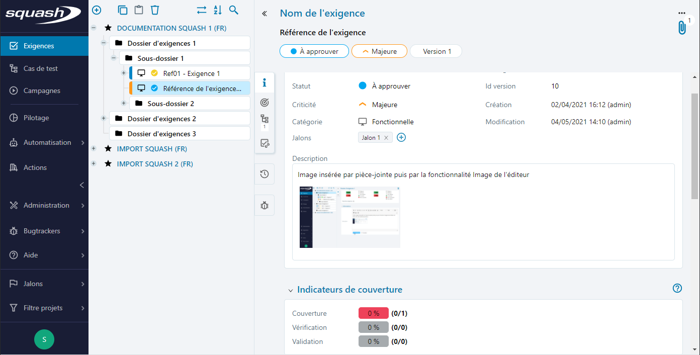

# Les champs texte riche

Les champs textes riches peuvent accueillir du texte sur plusieurs lignes et offrent la possibilité de mettre en forme ce texte, d'insérer des tableaux, des images ou des liens.

La mise en forme de ces champs est conservée dans les exports. Néanmoins, pour que ces fichiers soient générés correctement, il est nécessaire de respecter les règles suivantes pour insérer des éléments dans les champs texte riche. 

## Insérer un tableau

 Pour insérer un tableau dans un champ texte riche :

 1. Cliquer sur l'icône **[Tableau]**
 2. Renseigner les propriétés du tableau : nombre de lignes, nombre de colonnes, propriétés avancées
 3. Cliquer sur **[Ok]**
   
 Capture à mettre
   
 Le tableau est inséré et prêt à être renseigné

## Insérer un lien

 Pour insérer un lien dans un champ texte riche :

 1. Sélectionner une chaîne de caractère sur laquelle le lien devra être inséré
 2. Cliquer sur le bouton  **[Lien]**
 3. Renseigner le lien et ses propriétés (type, mode d'ouverture)
 4. Cliquer sur **[OK]**
  

  
 
 Il est désormais possible d’accéder au lien via un simple clic sur ce dernier.

## Insérer une image

Pour insérer une image stockée en ligne dans un champ texte riche : 

 1. A partir du mode édition du champ texte riche,  cliquer sur l'icône **[Image]**
 2. Renseigner url de l'image et ses propriétés : saisir un texte alternatif, redimensionner l'image, insérer une infobulle au survol de l'image
  

  
 3. Cliquer sur **[OK]**

L'image s'affiche dans le champ texte riche avec les propriétés définies précédemment.

Pour ajouter une capture d'écran, réaliser au préalable des étapes suivantes avant de procéder à l'insertion de l'image dans le champ texte : 

 1. A partir de la page de consultation de l'élément, ajouter une pièce jointe via la fonctionnalité accessible par l'icone 
 2. Récupérer l'url par clic droit sur le nom de l'image puis copier l'adresse du lien
