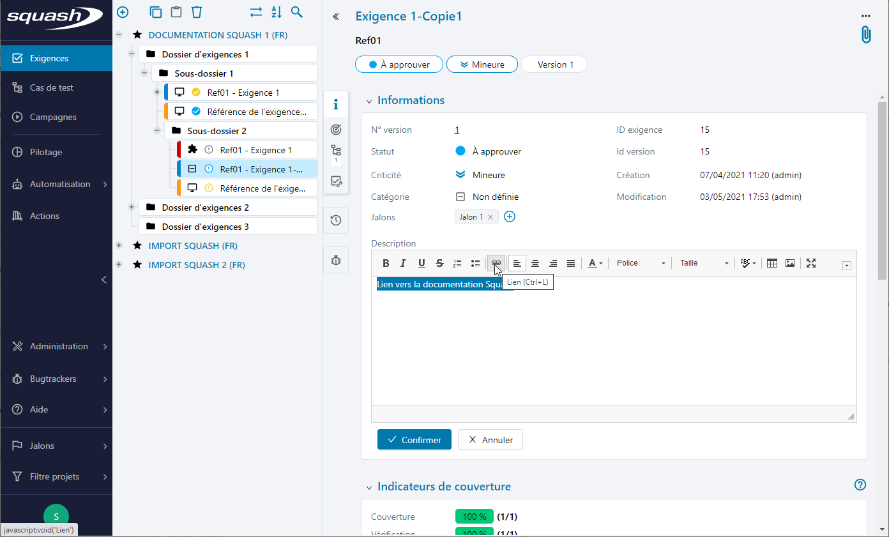

# Les champs texte riche

Les champs textes riches, natifs ou personnalisés, pouvant accueillir un volume conséquent de contenu, offrent la possibilité de mettre en forme le texte, d'insérer des tableaux, des images ou des liens.
Certains exports ou rapports de Squash prennent en charge les mises en forme des champs riches mais il convient, afin d'optimiser leur génération, d'utiliser les outils dédiés à l'insertion d'images ou liens. Nous ne recommandons pas l'utilisation du copié/collé d'image, d'autant que tous les navigateurs ne le permettent.

## Insérer un lien

 - saisir une chaîne de caractère sur laquelle le lien devra être insérer
 - sélectionner cette chaîne
 - cliquer sur le bouton  **[Lien]**
  

  
 - dans type de lien sélectionner le type du lien
 - compléter avec les informations correspondantes
 - dans l’onglet Cible, il est possible de sélectionner le mode d’ouverture du lien créer (ex : dans un nouvel onglet, une nouvelle fenêtre, dans une fenêtre pop-up…). 
 - cliquer sur **[OK]**
  

  
Il est désormais possible d’accéder au lien via un simple clic sur ce dernier sans avoir à éditer le champ.

## Insérer une image

Pour insérer une image : 

 - à partir de la page de consultation de l'élément, ajouter une pièce-jointe via la fonctionnalité accessible par l'icone 
 - ajouter l'image
 - récupérer l'url par clic droit sur le nom de l'image puis copier l'adresse du lien
 - à partir du mode édition du champ texte riche, accéder à la fonctionnalité **Image**
  

  
 - une popup à différents onglets permet alors de renseigner les propriétés de l'image à insérer : coller l'url dans le champ correspondant, saisir un texte alternatif, redimensionner l'image, insérer une infobulle au survol de l'image
  

  

<!--stackedit_data:
eyJoaXN0b3J5IjpbLTE2MjE1MzQ2NzJdfQ==
-->
