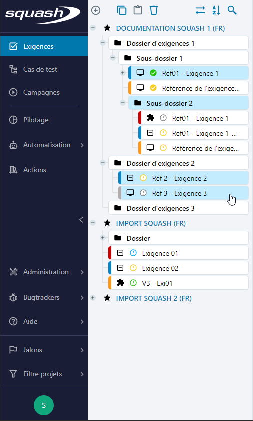

# Déplacer un objet

À partir d'une sélection simple ou multiple, continue ou discontinue (par [maj] + clic ou [ctrl]+ clic), il est possible de déplacer la sélection au sein d'un même projet ou vers un autre projet.
Une fois la sélection active, le clic maintenu sur la sélection autorise son déplacement.
Au survol des cibles (exigences, dossiers ou projet), elles deviennent grises. Une fois la sélection déplacée, la bibliothèque est mise à jour.
Toutes les associations de l'objet sont conservées (exigences-cas de test, appel de cas de test...).

Lorsque la cible est un autre projet ou un élément d'un autre projet, les éléments déplacés récupèrent les valeurs par défaut des configurations, attributs ou champs personnalisés du projet cible.
Si l'objet déplacé appartenait à un jalon et que le projet cible ne partage pas ce jalon, alors l'objet est dissocié du jalon.

 

!!! warning "Focus"
Lorsque la bibliothèque est en ordre positionnel, la position cible du ou des éléments déplacés devient la position définitive.

<!--stackedit_data:
eyJoaXN0b3J5IjpbLTE1NTc3MDA1NDRdfQ==
-->
