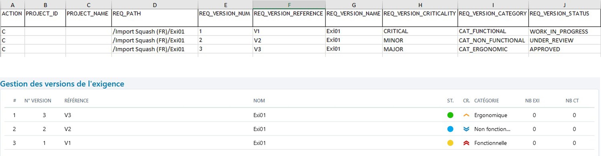

# Importer des exigences

Squash permet d’importer une arborescence d'exigences depuis un fichier au format .xls. 

Pour réaliser cet import, il  faut renseigner un fichier Excel en respectant les recommandations faites dans [Renseigner un fichier d'import d'exigences](lien à mettre vers la partie) puis l'importer via l'option **[Importer]** de l'espace Exigences. Il est possible de simuler l'import pour vérifier la cohérence du fichier d'import avant de l'importer.

L'import permet de créer des exigences avec toutes les fonctionnalités disponibles dans l'espace Exigences :

### Créer une arborescence d'exigences

L'arborescence est très importante car elle permet d'**organiser le référentiel d'exigences**. L'import offre la possibilité de créer une arborescence précise des éléments à importer et ce dans plusieurs projets à la fois : Exigences, Dossiers, [Exigences mères et filles](Lien vers l'explication des exigences mères et filles), etc.

Si les dossiers sont inexistants dans Squash au moment de l'import, ceux-ci sont créés par l'import. 

<u>**Par exemple :**</u>

Pour le chemin /Projet1/Dossier1/ExigenceMère/ExigenceFille :

- Si l’exigence ExigenceMère est présente dans le référentiel, ExigenceFille est ajoutée sous l'exigence mère ExigenceMère. 
- Si l’exigence mère n’existe pas dans le référentiel mais est présente dans le fichier d’import AVANT l'exigence fille, ExigenceFille est ajoutée sous l'exigence mère ExigenceMère. 
- Si l’exigence mère n’existe pas dans le référentiel, n’est pas présente dans le fichier d’import ou présente après l'exigence fille, alors l’exigence ExigenceFille est ajoutée dans le dossier ExigenceMère, sous-dossier de Dossier1.

### Importer des versions d'exigences

Pour **créer** plusieurs versions d'une même exigence, il faut une ligne par version dans le fichier Excel. Le numéro de la version à créer est à renseigner dans la colonne "REQ_VERSION_NUM".

!!! warning "Focus"
	Pour créer la version 3 d'une exigence, une version 2 dans le fichier d'import ou dans le référentiel doit impérativement être présente

Pour **modifier** les attributs d'une version d'exigence, la colonne "REQ_VERSION_NUM" doit être renseignée avec le numéro de la version à modifier et la colonne "REQ_PATH" avec le chemin de la version courante de l'exigence.

### Importer des exigences avec une liste personnalisée
Si une liste personnalisée est configurée pour la catégorie des exigences sur le projet, dans le fichier d'import, **le code de l'option** souhaitée sera à renseigner dans la colonne "REQ_VERSION_CATEGORY".

**Par exemple :**

1. Avoir une liste personnalisée avec plusieurs options, dont une des options est "Option2" associée au code "Opt2".
 

 
3. Dans le fichier Excel, renseigner la valeur du code de l'option dans la colonne "REQ_VERSION_CATEGORY" : ici "Opt2"

4. Lorsque le fichier est importé, l'exigence est créée et le champ 'Catégorie' est renseigné par "Option2"

### Importer des exigences avec des champs personnalisés

Si des champs personnalisés (CUF) sont configurés pour les exigences du projet, dans le fichier d'import, la colonne "REQ_VERSION_CUF_<code du cuf\>" peut être renseignée, à raison d'une colonne par champ personnalisé. L'entête de la colonne doit comporter le code du champ personnalisé présent sur sa page de consultation.

Contenu de la colonne "REQ_VERSION_CUF_<code du cuf\>" :

| Type de champ personnalisé | Valeur attendue |
|--|--|
| Tag | Tag1\|Tag2 |
| Case à cocher| 'true' ou 'false' |
| Liste déroulante | Libellé de l'option |
| Numérique| Par exemple : '50', '12,8' |
| Date| 'AAAA-MM-JJ'  |
| Texte simple| Texte avec 255 caractères maximum sans mise en forme  |
| Texte riche| Pour importer de la mise en forme, le texte doit être en HTML  |
 

### Importer des exigences avec des associations à des cas de test

L'onglet "LINK_REQ_TC" du fichier d'import est à compléter avec le chemin de l'exigence, le numéro de la version ainsi que le chemin du cas de test à associer. Pour que l'association fonctionne, le cas de test doit au préalable exister dans le référentiel Squash.

Les informations sont visibles après l'import dans l'ancre 'Cas de test vérifiant cette exigence'  de l'exigence.

### Importer des exigences avec des associations à des exigences

L'onglet "LINK_REQ_REQ" du fichier d'import est à compléter avec les chemins des deux exigences à lier ainsi que leur numéro de version. Le code du type de lien sera également à renseigner. Pour que l'association fonctionne, l'exigence à lier doit au préalable exister dans le référentiel Squash ou être présente dans le fichier d'import.

Les informations sont visibles après l'import dans l'ancre 'Exigences liées' de l'exigence.
