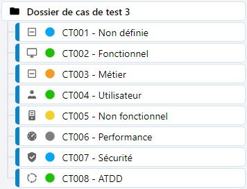

# Organiser le référentiel de tests

Squash TM offre plusieurs moyens visuels et méthodologiques permettant d'organiser le référentiel et d'identifier facilement les tests et leurs attributs. 

## Les références

Une référence est un identifiant unique facilitant l'identification du cas de test notamment dans la bibliothèque. Les cas de test y sont rangés par ordre alphanumérique de la référence puis du nom du cas de test. 

Pour que le référentiel soit organisé de façon cohérente, il est important de définir des conditions de nommage pour les références et les noms des cas de test. 

!!! note "Info"
    La création de dossier et sous-dossier est également un excellent moyen d'organiser le référentiel de tests au sein d'un même projet.

## Les capsules

Les capsules sont visibles sur la page de consultation d'un cas de test, sous la référence. Elles indiquent:
- le statut du cas de test
- son importance
- le statut de la dernière exécution

La couleur de la capsule 'Statut' est également visible dans une pastille, précédent la référence ou le nom du cas de test dans la bibliothèque.

## Les icônes et les pastilles

## Les couleurs

Chaque format de cas de test est représenté par une couleur de police spécifique visible dans la bibliothèque de l'espace Cas de test:

- Cas de test Classique en noir
- Cas de test Gherkin en bleu
- Cas de test BDD en vert 

