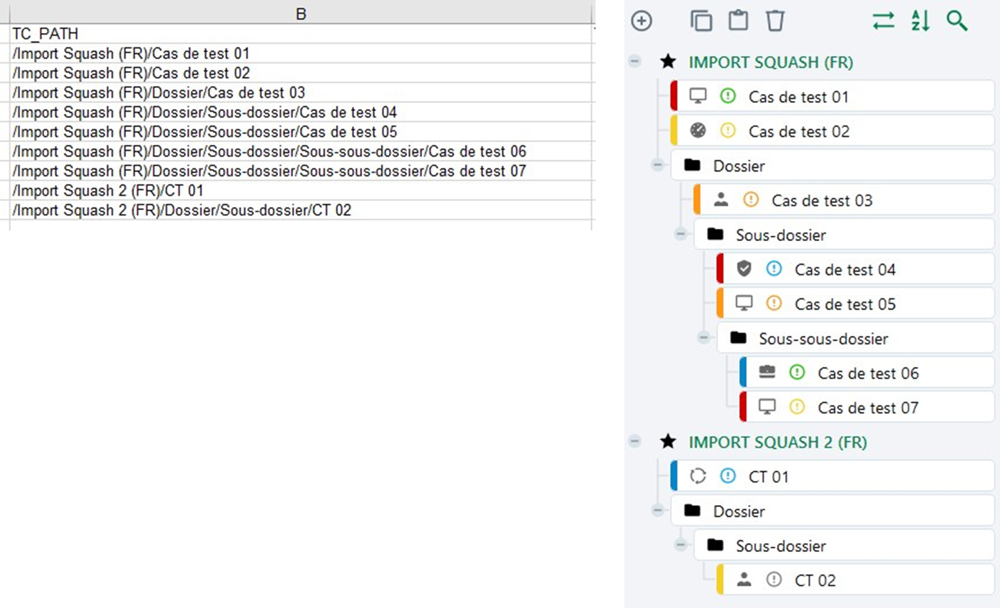

# Importer des cas de test

Squash permet d’importer une arborescence de cas de test depuis un fichier au format .xls ou .zip 

Pour réaliser cet import, il  faut renseigner un fichier Excel en respectant les recommandations faites dans [Renseigner un fichier d'import de cas de test](lien à mettre vers la partie) puis l'importer via l'option **[Importer]** de l'espace Cas de test. Il est possible de simuler l'import pour vérifier la cohérence du fichier d'import avant de l'importer.

!!! tip "En savoir plus"
	Pour plus de détails sur la procédure à suivre pour réaliser un import, consulter la page [Importer/Exporter un objet](lien à ajouter).

L'import permet de créer des cas de test avec toutes les fonctionnalités disponibles dans l'espace Cas de test:

### Créer une arborescence de cas de test

L'arborescence est très importante car elle permet d'**organiser le référentiel de tests**. L'import offre la possibilité de créer une arborescence précise des dossiers et cas de test à importer et ce dans plusieurs projets à la fois.

Si les dossiers sont inexistants dans Squash au moment de l'import, ceux-ci sont créés par l'import. 

**Par exemple :**

Pour le chemin:  /Projet1/Dossier1/Sousdossier1/Casdetest1

Le cas de test Casdetest1 est ajouté dans le projet Projet1, dans le dossier Sousdossier1, sous-dossier de Dossier1.

### Importer des cas de test avec une liste personnalisée
Si une liste personnalisée est configurée pour la nature et/ou le type des cas de test sur le projet, dans le fichier d'import, **le code de l'option** souhaitée est à renseigner dans la colonne "TC_NATURE" et/ou "TC_TYPE"

**Par exemple :**

1. Avoir une liste personnalisée avec plusieurs options, dont une des options est "Nature2" associée au code "N2".

2. Dans le fichier Excel, renseigner la valeur du code de l'option dans la colonne "TC_NATURE" : ici "N2"

3. Lorsque le fichier est importé, le cas de test est créée et le champ 'Nature' est renseigné par "Nature2"

### Importer des cas de test avec des champs personnalisés

Si des champs personnalisés (CUF) sont configurés pour les cas de test du projet, dans le fichier d'import, la colonne "TC_CUF_<code du cuf\>" peut être renseignée, à raison d'une colonne par champ personnalisé. L'entête de la colonne doit comporter le code du champ personnalisé présent sur sa page de consultation.

Contenu de la colonne "TC_CUF_<code du cuf\>" :

| Type de champ personnalisé | Valeur attendue |
|--|--|
| Tag | Tag1\|Tag2 |
| Case à cocher| 'true' ou 'false' |
| Liste déroulante | Libellé de l'option |
| Numérique| Par exemple : '50', '12,8' |
| Date| 'AAAA-MM-JJ'  |
| Texte simple| Texte avec 255 caractères maximum sans mise en forme  |
| Texte riche| Pour importer de la mise en forme, le texte doit être en HTML  |

 

### Importer des cas de test avec des associations à des exigences

L'onglet "LINK_REQ_TC" du fichier d'import est à compléter avec le chemin de l'exigence, le numéro de la version ainsi que le chemin du cas de test à associer. Pour que l'association fonctionne, l'exigence doit au préalable exister dans le référentiel.

Les informations sont visibles après l'import dans l'ancre **Exigences vérifiées par ce cas de test**  du cas de test.

### Importer des pas de test
Cet onglet permet d'importer des pas de test pour un cas de test Classique.

![Importer des pas de test pour un cas de test classique](resources/import-pasdetest.png 

### Importer des paramètres et des jeux de données

### Importer un cas de test faisant appel à un autre cas de test

### Importer un cas de test Gherkin avec un script

!!! warning "Focus" 
	Il n'est pas possible d'importer des cas de test BDD
